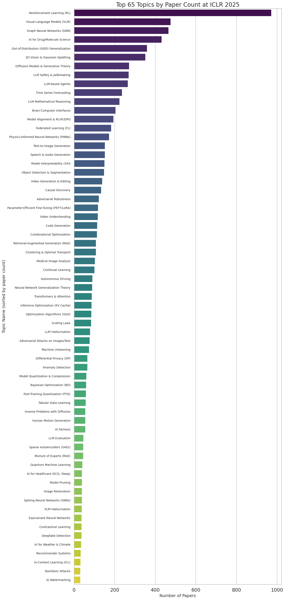
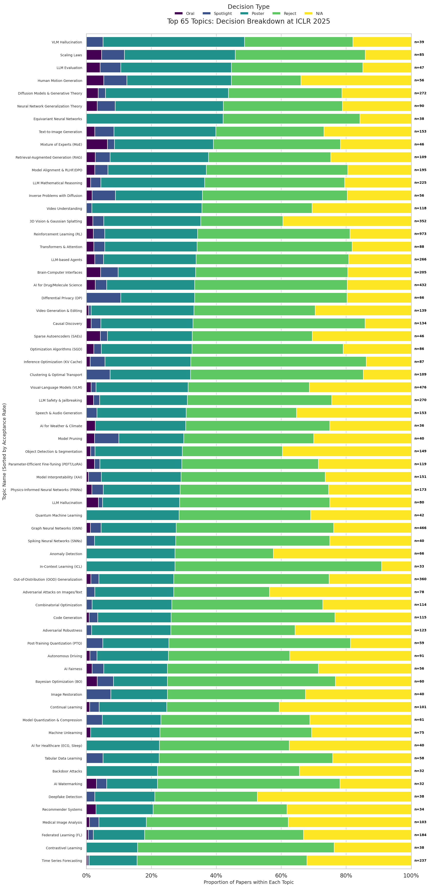
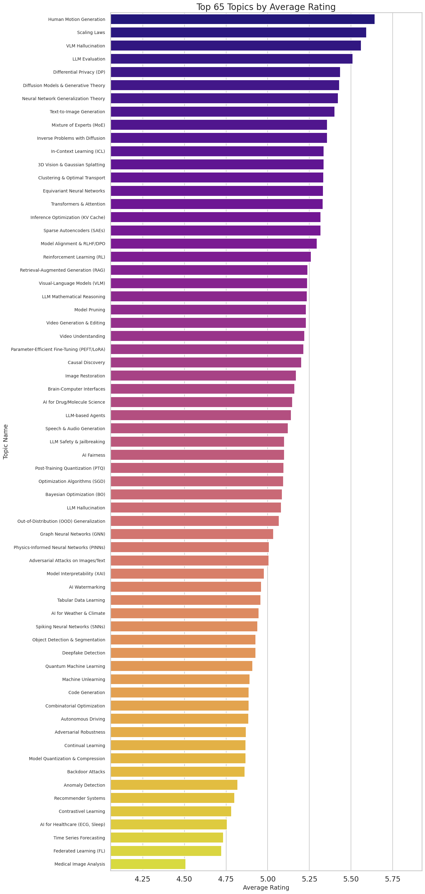
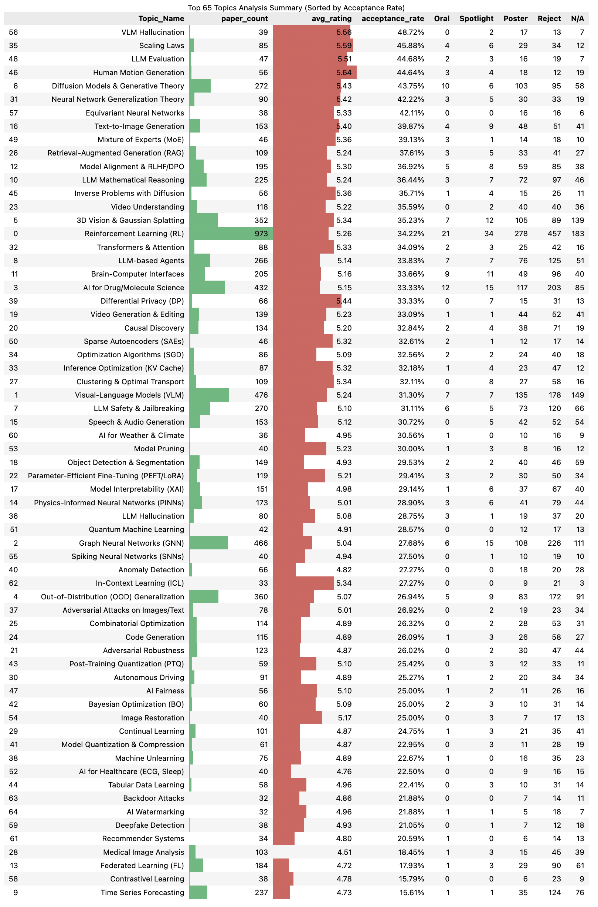

<div align="right"><a href="README.md">English</a> | <strong>中文</strong></div>

# AI 论文趋势分析

[](https://www.python.org/downloads/) [](LICENSE)

AI Paper Trends 是一条配置驱动的会议论文趋势分析流水线。它从 OpenReview 获取公开投稿、评审和录用决定，使用 BERTopic 聚类研究主题，最后生成主题热度、评分、录用情况、图表和汇总表。

## 当前能做什么

1. 获取指定 OpenReview 会场的公开投稿。
2. 可选地在同一批请求中读取公开评审、分数和最终决定。
3. 合并标题、关键词和摘要，形成主题建模文本。
4. 使用 Sentence Transformer 和 BERTopic 分配研究主题。
5. 根据主题关键词自动生成可读标签。
6. 输出论文数量排名、平均评分排名、录用构成图以及 CSV/HTML 汇总表。

仓库内配置覆盖使用 OpenReview 的 ICLR、ICML、NeurIPS 和 CVPR 部分年份。目前尚未直接接入 ACM DL、IEEE Xplore、CVF Open Access、PMLR、ACL Anthology 等其他论文库。

## 示例结果






## 项目结构

```text
.
├── configs/                 # 可直接运行的会议配置
├── data/                    # 原始和处理后数据（Git 忽略）
├── docs/images/             # README 示例图片
├── models/                  # 下载的嵌入模型（Git 忽略）
├── results/                 # 模型、标签、图表和表格（Git 忽略）
├── src/
│   ├── analyze.py           # 统计和可视化
│   ├── get_papers.py        # OpenReview 数据获取
│   └── run_topic_modeling.py# BERTopic 建模和主题标签
├── tests/                   # 轻量单元测试
├── main.py                  # 命令行主入口
└── requirements.txt
```

## 安装

推荐使用 Python 3.10 或更高版本，并创建独立虚拟环境。

```powershell
python -m venv .venv
.\.venv\Scripts\Activate.ps1
python -m pip install --upgrade pip
pip install -r requirements.txt
```

PyTorch 等模型依赖体积较大，第一次安装和下载模型需要一定时间和磁盘空间。

## 运行

```powershell
python main.py --config configs/iclr_2025_full_analysis.yaml
```

默认会复用已有原始数据和主题结果。强制重新抓取与建模：

```powershell
python main.py --config configs/iclr_2025_full_analysis.yaml --force-rerun
```

如果 OpenReview 阻止匿名自动访问，可以先通过环境变量提供 OpenReview 账号：

```powershell
$env:OPENREVIEW_USERNAME="your-email@example.com"
$env:OPENREVIEW_PASSWORD="your-password"
python main.py --config configs/iclr_2025_full_analysis.yaml --force-rerun
```

不要把账号密码提交到 Git。仓库会忽略 `.env`，程序直接读取当前进程的环境变量。

## 配置说明

```yaml
conference_id: ICLR.cc/2025/Conference
fetch_reviews: true
limit: null

topic_modeling:
  enabled: true
  model_id: sentence-transformers/all-mpnet-base-v2
  min_topic_size: 30
  embedding_batch_size: 32
  cpu_threads: 0
  heartbeat_seconds: 15

analysis:
  enabled: true
  top_n: 65
  tasks:
    - plot_paper_count
    - plot_avg_rating
    - plot_decision_breakdown
    - generate_summary_table

output_folder_name: iclr_2025_analysis
```

- `conference_id`：OpenReview 上准确的公开会场 ID。
- `fetch_reviews`：是否读取公开决定和评分。关闭后仍可分析主题数量，但没有评分和录用率。
- `limit`：用于快速测试的论文上限；`null` 表示全部论文。
- `model_id`：ModelScope 可下载的 Sentence Transformer 模型 ID。
- `min_topic_size`：BERTopic 最小主题规模，小样本测试时会自动调低。
- `embedding_batch_size`：每批编码的论文数；内存不足时可以调低。
- `cpu_threads`：PyTorch、UMAP 和 HDBSCAN 使用的 CPU 线程数；`0` 表示自动使用全部逻辑核心。
- `heartbeat_seconds`：机器学习耗时阶段的心跳输出间隔，用于区分运行中和卡住。
- `top_n`：每份图表和汇总表最多显示多少个主题。

`data/`、`models/` 和 `results/` 是运行产物，可能达到数百 MB，因此不会提交到 Git。

## 验证

```powershell
python -m unittest discover -s tests -v
python -m compileall -q main.py src tests
```

## 许可证

项目使用 [MIT License](LICENSE)。
