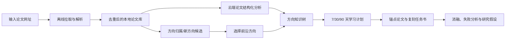
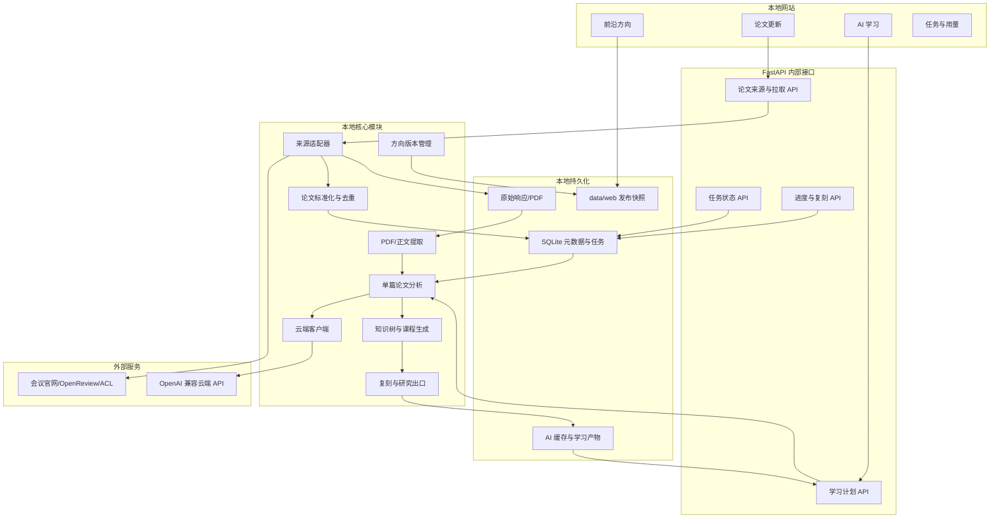

# 论文增量与云端 AI 学习系统设计

> 状态：第一阶段已实现并通过 mock API 验收；后续阶段保留在本文档中
>
> 日期：2026-07-18
>
> 适用项目：AI Paper Trends
> 目标版本：现有“前沿选题雷达”的下一阶段

## 0. 当前实现边界（2026-07-18）

本次实现完成了可独立运行的第一阶段：网页输入公开网址、JSON/HTML/ACL 解析、字段标准化、SQLite 去重、任务进度与错误记录、原始响应快照、可选 PDF 下载、已保存来源再次拉取；新增论文保持“未分析”，用户可单独启动 AI 方向更新，将论文映射到现有方向或保存新方向候选草稿，正式 13 个方向不会被自动改写；同时完成了方向知识树、7/30/90 天计划、锚点论文、L0–L4 复现阶梯、最小研究假设和学习进度写回。测试默认使用确定性 mock 客户端，不产生云端费用。

真实云端调用只位于 `src/cloud_ai/client.py`，配置位于 `settings/cloud_ai.yaml`，密钥只从 `CLOUD_AI_API_KEY` 环境变量读取。把 `provider` 从 `mock` 改为 `openai_compatible` 并填写实际模型名后即可接入兼容 Chat Completions 的云端服务。

仍属于后续阶段的内容包括：PDF 正文分段/页码引用、OpenReview 专用分页连接器、候选方向人工确认与正式发布、失败任务恢复和预算预估。本文档后续相关章节是目标设计，不代表这些能力已经完成。

## 1. 文档摘要

本设计在现有 600 篇论文、13 个前沿方向和本地 FastAPI 网站基础上，增加两套彼此独立的能力：

1. **论文增量模块**：用户输入会议或论文集网址，系统离线拉取、解析、去重并保存论文。该过程不调用云端 AI。
2. **云端 AI 学习模块**：用户选择一个前沿方向和自身条件，系统基于已经拉取的论文正文生成知识树、7/30/90 天计划、锚点论文、复刻任务书和研究改进出口。

两套模块只通过本地论文库连接：



核心约束如下：

- 拉取论文时绝不自动调用云端 API。
- 云端模型获取“最新知识”的来源是本地新论文，而不是依赖模型自身知识截止时间。
- API Key 仅保存在服务端环境变量中，不能出现在代码、配置文件或浏览器中。
- 默认测试不发送真实云端请求；真实 API 测试必须显式开启并限制输入量。
- 云端输出必须通过结构化数据校验，并能追溯到本地论文、章节或页码。
- 第一版继续本地运行，不要求 Docker。

## 2. 背景与问题

现有网站已经能够：

- 展示 ICLR、ICML、ACL 2026 的 600 篇公开论文。
- 将 24 个底层主题聚类归纳为 13 个可读前沿方向。
- 按研究资源给出方向切入友好度。
- 展示方向总结、切入点、资源门槛、风险和代表论文。

仍缺少两项关键能力：

### 2.1 数据不能由用户方便地增量更新

当前 2026 数据通过专用构建脚本生成。新增会议或不规则论文页面时，用户需要修改代码，无法在网页中直接输入网址并拉取。

### 2.2 “知道方向”还不能转化为“掌握方向”

当前网站回答了“前沿在研究什么”，但没有回答：

- 需要先学习哪些知识？
- 知识之间的前置依赖是什么？
- 7、30 或 90 天内应该如何安排？
- 哪篇论文最适合作为第一次复刻目标？
- 复刻到什么程度才算真正掌握？
- 如何从复刻结果形成自己的研究假设？

本设计以这两个问题为边界，不把论文爬取和 AI 学习混成一个不可控流程。

## 3. 目标与非目标

### 3.1 产品目标

#### 论文增量

- 页面提供“网址输入框”和“拉取论文”按钮。
- 支持重复保存来源并在未来重新拉取。
- 支持 OpenReview、会议公开 JSON、ACL Anthology 和普通 HTML 页面。
- 自动统一字段、去重、记录新增/重复/失败数量。
- 可选下载 PDF，但不执行论文仓库中的任何代码。
- 提供等价命令行入口，便于调试和定期运行。

#### 云端 AI 学习

- 根据方向、用户基础、周期、硬件和目标生成知识树。
- 生成可执行的 7/30/90 天或自定义学习计划。
- 每个学习任务必须包含产物和验收标准。
- 推荐与用户硬件匹配的锚点论文。
- 生成从“跑通”到“消融和改进”的复刻任务书。
- 将失败分析转化为可验证研究假设，而不是只生成论文标题。
- 所有论文性结论均保留论文证据。

#### 新方向更新

- 新论文拉取后先进入“未分析”状态。
- 方向分析是独立任务，可以映射现有方向或形成新方向候选。
- 新方向必须经过规则校验和用户确认后才发布。
- 方向、知识树和学习计划都带版本及论文截止日期。

### 3.2 非目标

- 不承诺解析互联网上任意结构、任意登录态或强反爬网站。
- 不在服务器上自动执行第三方论文代码。
- 不把大模型输出当作论文事实来源。
- 不自动投稿、自动写整篇论文或预测录用概率。
- 第一版不提供多用户账号、云端部署和分布式任务队列。
- 第一版不要求 Docker、Redis、Celery 或独立数据库服务。

## 4. 设计原则

### 4.1 拉取与分析严格分离

论文拉取只做网络获取、解析、标准化、去重、PDF 保存和元数据入库。云端 API 只在用户主动创建 AI 学习任务时调用。

### 4.2 最新知识来自论文正文

云端模型是否预训练过某篇 2026 论文并不可靠。系统必须把本地论文摘要、正文、附录和官方代码说明作为上下文交给模型。

### 4.3 结构化输出优先

所有核心 AI 产物使用固定 JSON Schema/Pydantic 模型，不直接把一段自由文本保存为最终结果。

### 4.4 证据优先

方向结论、知识节点、复刻要求和研究缺口必须引用本地 `paper_id`；能够取得 PDF 页码或章节时，还应保存页码和章节。

### 4.5 可恢复与可复现

拉取和 AI 任务都有持久化状态、阶段进度、错误记录、输入哈希、模型名称、提示词版本和用量记录。服务重启后可以查看失败原因或继续任务。

### 4.6 人控制花费与发布

- 拉取完成不自动分析。
- 创建 AI 任务前展示论文数、预计输入规模和是否命中缓存。
- 新方向、知识树和学习计划生成后先保存为草稿。
- 用户确认后才成为网站正式版本。

## 5. 总体架构



## 6. 目录设计

建议在现有仓库中增加以下目录和文件：

```text
settings/
  cloud_ai.yaml                       云端模型、地址和超时配置（无密钥）

scripts/
  pull_papers.py                      离线拉取命令入口
  run_cloud_analysis.py               云端单篇/方向分析命令入口
  build_learning_plan.py              学习计划命令入口

src/
  paper_sources/
    __init__.py
    base.py                            来源适配器协议
    detector.py                        自动识别来源类型
    openreview.py                      OpenReview 适配器
    virtual_program.py                 ICLR/ICML 类 JSON 适配器
    acl_anthology.py                   ACL 适配器
    generic_json.py                    普通 JSON 适配器
    generic_html.py                    普通 HTML 适配器
    normalizer.py                      统一 PaperRecord
    deduplicator.py                    ID/URL/标题去重
    pdf_store.py                       PDF 下载和校验

  cloud_ai/
    __init__.py
    client.py                          唯一云端 API 调用位置
    schemas.py                         Pydantic 输出结构
    prompts.py                         提示词和版本
    cache.py                           内容哈希缓存
    paper_analyzer.py                  单篇结构化分析
    direction_analyzer.py              跨论文方向综合
    knowledge_tree.py                  知识树生成与校验
    learning_planner.py                7/30/90 天计划
    paper_curriculum.py                阅读顺序与锚点论文
    reproduction.py                    复刻任务书
    research_ideas.py                  失败分析与研究假设

  storage/
    database.py                        SQLite 连接和事务
    migrations.py                      数据结构迁移
    repositories.py                    数据访问层
    artifact_store.py                  PDF、原始响应、AI 产物保存

  jobs/
    manager.py                         本地后台任务管理
    models.py                          任务状态
    progress.py                        进度事件和心跳

web/
  routes/
    paper_updates.py                   论文增量 API
    learning.py                        AI 学习 API
    jobs.py                            任务和用量 API
  templates/
    paper_updates.html                 论文更新页面
    learning.html                      AI 学习页面

tests/
  fixtures/
    paper_sources/                     小型固定 HTML/JSON 测试样本
    cloud_ai/                          模拟云端响应
  test_paper_sources.py
  test_paper_updates_api.py
  test_cloud_ai_client.py
  test_knowledge_tree.py
  test_learning_planner.py
  test_reproduction_guide.py
  test_learning_api.py
  test_live_cloud_ai.py                默认跳过的真实 API 测试
```

运行数据继续由 Git 忽略：

```text
data/local/app.db                      来源、论文索引、任务、进度和用量
data/raw/incremental/                  每次拉取的原始标准化结果
data/raw/source_snapshots/             原始 HTML/JSON 响应
data/pdfs/                             PDF 文件
data/fulltext/                         PDF 提取文本
data/ai/cache/                         单篇和方向级 AI 缓存
data/learning/plans/                   知识树和学习计划产物
data/learning/reproduction/            复刻任务书
```

`data/web/` 仍然只保存经过确认、用于网站公开展示的只读快照。

## 7. 论文增量模块

### 7.1 页面交互

“论文更新”页面默认只暴露两个主要控件：

1. 论文集/会议页面网址输入框。
2. “拉取论文”按钮。

网址下方提供折叠的高级选项：

- 会议名称。
- 年份。
- 来源类型：自动识别、OpenReview、官方 JSON、ACL、普通 JSON、普通 HTML。
- 本次最大数量。
- 是否下载 PDF。
- 是否保存为长期来源，便于下次重新拉取。
- 普通 HTML 解析失败时的 CSS Selector 覆盖项。

点击拉取后立即返回 `job_id`，页面显示：

- 当前阶段。
- 已发现论文数。
- 新增数。
- 重复数。
- 缺少摘要/PDF 数。
- 解析失败数和具体原因。
- 最近一次进度心跳。

拉取任务完成后，论文自动进入本地论文库，但状态为 `unanalysed`，不会自动调用云端 AI。

### 7.2 命令行入口

```powershell
python -m scripts.pull_papers `
  --url "https://example.org/conference/2026/papers" `
  --conference "ExampleConf" `
  --year 2026 `
  --parser auto `
  --download-pdf
```

重复执行相同命令应具有幂等性：已存在论文只更新来源和内容哈希，不创建重复记录。

### 7.3 来源适配器接口

```python
class PaperSourceAdapter(Protocol):
    def can_handle(self, source: SourceDefinition) -> bool: ...
    def fetch(self, source: SourceDefinition) -> RawSourceSnapshot: ...
    def parse(self, snapshot: RawSourceSnapshot) -> list[PaperCandidate]: ...
```

自动识别顺序：

1. 用户显式指定的解析器。
2. OpenReview URL 规则。
3. ACL Anthology URL 规则。
4. 已知会议官方 JSON 规则。
5. HTTP Content-Type 和 JSON 结构探测。
6. 通用 HTML 页面解析。

无法解析时保留原始响应并返回可操作错误，不静默生成空结果。

### 7.4 拉取状态机

```text
queued
  → fetching
  → parsing
  → normalizing
  → deduplicating
  → downloading_pdfs（可选）
  → persisting
  → completed

任意阶段 → failed / cancelled
```

每个阶段保存：开始时间、结束时间、已处理数量、错误摘要和心跳时间。

### 7.5 去重规则

按以下优先级生成唯一论文：

1. 官方论文 ID 完全相同。
2. DOI/Anthology/OpenReview ID 完全相同。
3. 规范化官方 URL 完全相同。
4. 标题规范化后完全相同，且年份和作者集合高度一致。
5. 标题相似但无法确认时标记为 `possible_duplicate`，不自动合并。

每次合并必须保留所有来源记录，不能因为去重丢失溯源信息。

### 7.6 PDF 和代码资源

拉取阶段可以记录或下载：

- 官方 PDF。
- 论文页面给出的官方代码仓库。
- 数据集链接。
- 模型权重链接。

限制：

- 只允许 HTTP/HTTPS。
- 不执行仓库代码和安装脚本。
- PDF 按内容哈希命名，避免重复下载。
- 记录下载时间、最终 URL、Content-Type、大小和 SHA-256。
- 超大文件、非 PDF 响应和重定向异常必须中止并报告。

## 8. 云端 API 集成

### 8.1 唯一代码位置

所有云端请求统一经过：

```text
src/cloud_ai/client.py
```

业务模块不得自行使用 `requests` 或 `httpx` 调用云端模型。

配置文件：

```yaml
# settings/cloud_ai.yaml
provider: openai_compatible
base_url: https://api.example.com/v1
model: your-model-name
api_key_env: CLOUD_AI_API_KEY
timeout_seconds: 90
temperature: 0.2
prompt_version: learning-plan-v1
```

密钥只从环境变量读取：

```powershell
$env:CLOUD_AI_API_KEY="你的密钥"
```

禁止：

- 将密钥写入 `cloud_ai.yaml`。
- 将密钥提交 Git。
- 将密钥返回给浏览器。
- 由前端直接请求云端 API。

### 8.2 客户端接口

```python
class CloudAIClient:
    async def generate_structured(
        self,
        *,
        schema: type[BaseModel],
        system_prompt: str,
        user_content: str,
        request_key: str,
    ) -> tuple[BaseModel, UsageRecord]: ...
```

客户端统一负责：

- 认证。
- 超时和指数退避。
- 并发限制。
- 429/5xx 重试。
- 结构化输出解析。
- 用量记录。
- 请求/响应内容哈希。
- 缓存命中。
- 日志脱敏。

### 8.3 两阶段分析

不能把全部论文一次性放进一个请求。

#### 阶段 A：单篇论文结构化分析

每篇论文输出：

- 研究问题。
- 核心贡献。
- 方法结构。
- 前置知识。
- 数据集和指标。
- 基线和消融。
- 计算资源。
- 代码/数据/权重可用性。
- 复刻难点。
- 局限与失败模式。
- 对应证据。

缓存键：

```text
paper_content_hash + model + prompt_version + schema_version
```

#### 阶段 B：方向级综合

方向级请求主要使用阶段 A 的结构化结果，并在需要时附加少量代表论文正文，输出：

- 方向现状。
- 方法谱系。
- 知识依赖。
- 论文阅读顺序。
- 学习树。
- 适合复刻的锚点论文。
- 开放问题和研究出口。

这样既避免单次上下文过大，也允许单篇分析结果被不同学习计划重复使用。

## 9. AI 学习模块

### 9.1 用户输入

创建学习计划时收集：

- `direction_id` 和方向版本。
- 当前基础：入门、会深度学习、已有相关经验，或自定义描述。
- 周期：7、30、90 天或自定义。
- 每日可用时间。
- 硬件：CPU、GPU 型号/显存、GPU 数量。
- 可用预算/是否允许付费 API 作为复刻依赖。
- 最终目标：看懂、跑通、复现、形成投稿实验。
- 是否自动选择锚点论文。

页面主按钮使用明确结果导向文案，例如：

> 生成我的 30 天学习与复刻计划

### 9.2 学习知识树

知识树使用有向无环图（DAG），而不是无序知识点列表。

节点至少包含：

```json
{
  "node_id": "dense_retrieval",
  "title": "Dense Retrieval",
  "level": "method",
  "prerequisite_ids": ["text_embedding", "similarity_metrics"],
  "why_required": "为什么该方向需要这个能力",
  "learning_goal": "掌握后的可观察能力",
  "estimated_hours": 6,
  "materials": [],
  "exercise": "最小代码练习",
  "deliverables": [],
  "acceptance_criteria": [],
  "related_paper_ids": []
}
```

节点层级：

- `foundation`：数学、编程、深度学习基础。
- `method`：方向核心方法。
- `evaluation`：数据、指标、评测和失败分类。
- `frontier`：最新论文正在解决的问题。
- `reproduction`：锚点论文专属技能。

校验要求：

- 不存在循环依赖。
- 所有前置节点必须存在。
- 每个核心节点至少有练习和验收标准。
- 每个前沿节点至少关联一篇本地论文。
- 锚点论文需要的节点必须在计划中出现或被标记为已掌握。

### 9.3 7/30/90 天计划

计划由知识树生成，不能绕过知识树直接生成自由文本日程。

每天/每个阶段至少包含：

- 学习节点。
- 学习目标。
- 预计时间。
- 阅读材料和论文。
- 代码或分析任务。
- 必须提交的产物。
- 验收标准。
- 前置任务。

30 天计划应覆盖以下阶段：

1. 基础能力补齐。
2. 方向核心基线。
3. 前沿论文阅读。
4. 锚点论文跑通。
5. 核心结果复现。
6. 消融与失败分析。
7. 研究假设和最小改进实验。

7 天计划可以只达到“理解 + 跑通最小基线”；90 天计划应增加多论文复刻、跨数据集验证和完整研究提案。

### 9.4 论文课程与锚点论文

论文阅读顺序不简单按年份排列，而按角色组织：

- 入口论文：建立问题定义和基本方法。
- 基线论文：提供可运行基线。
- 评测论文：解释指标和失败模式。
- 锚点论文：用户实际复刻的主要目标。
- 前沿论文：展示最新开放问题。

锚点论文可行性至少考虑：

- 官方代码是否存在。
- 数据是否公开。
- 权重是否可用。
- 环境是否明确。
- 核心指标是否可验证。
- 预计硬件是否匹配用户条件。
- 是否依赖付费闭源 API。
- 代码和论文版本是否一致。
- 许可证是否允许使用。

推荐结果必须解释“为什么适合你”，不能只给一个分数。

### 9.5 复刻任务书

复刻分为五级：

```text
L0 读懂：能够解释问题、方法、实验和贡献
L1 跑通：能够运行官方 Demo 或推理脚本
L2 复现：在一个公开数据集上对齐核心指标
L3 验证：完成消融、参数变化和失败案例分析
L4 改进：增加一个变量、场景或轻量模块并验证假设
```

任务书包含：

- 最小可复现范围。
- 官方论文、代码、数据和权重。
- 环境和固定版本。
- 数据检查步骤。
- 基线命令和预期输出。
- 核心方法命令和预期指标区间。
- 允许的结果误差和随机性说明。
- 消融实验。
- 失败案例模板。
- 常见故障和恢复方法。
- 从 L0 到 L4 的验收清单。

系统只生成经过校验的操作说明，不自动执行第三方代码。

### 9.6 研究出口

完成复刻后，AI 使用用户记录的结果、失败案例和消融数据生成候选研究假设：

```text
在条件 X 下，现有方法 Y 出现问题 Z；
推测原因是 R；
计划通过改动 M 处理；
使用数据 D、基线 B 和指标 N 验证；
若实验失败，可能否定的假设是 H。
```

每个候选假设必须包含：

- 已有证据。
- 与现有论文的区别。
- 最小实验。
- 所需资源。
- 失败风险。
- 可能贡献类型：评测、分析、轻量方法、攻防、系统或理论。

禁止只生成未经验证的论文标题或声称一定能够发表。

### 9.7 学习进度

用户可以为任务标记：

- `not_started`
- `in_progress`
- `completed`
- `blocked`
- `skipped`

同时记录：

- 实际耗时。
- 代码/笔记路径。
- 指标结果。
- 遇到的问题。
- 是否达到验收标准。

计划重新生成时保留已完成进度，并显示新旧计划差异，不直接覆盖。

## 10. 方向更新与版本

论文拉取完成后，方向分析作为独立任务运行：

```text
新增论文
  → 与现有方向比较
  → 可明确归属：添加到已有方向
  → 无法明确归属：进入新方向候选池
  → 云端生成候选总结和与旧方向差异
  → 规则校验
  → 用户确认发布
```

方向版本示例：

```json
{
  "taxonomy_version": "2026.07.1",
  "paper_cutoff": "2026-07-18T00:00:00Z",
  "added": [],
  "renamed": [],
  "split": [],
  "merged": [],
  "retired": []
}
```

学习计划保存：

- 方向版本。
- 论文截止日期。
- 模型名称。
- 提示词版本。
- 生成时间。

当方向或论文库更新后，旧计划标记为“存在新论文”，由用户决定是否重新规划。

## 11. 数据模型

第一版使用 Python 标准库 SQLite 保存可变元数据和任务状态，大文件继续保存到文件系统。数据库位置：

```text
data/local/app.db
```

### 11.1 `paper_sources`

| 字段 | 含义 |
|---|---|
| `id` | 来源 ID |
| `url` | 用户输入网址 |
| `conference` | 会议 |
| `year` | 年份 |
| `parser_type` | 解析器 |
| `download_pdf` | 是否下载 PDF |
| `created_at` | 创建时间 |
| `last_pulled_at` | 最近拉取时间 |
| `enabled` | 是否保留为长期来源 |

### 11.2 `papers`

| 字段 | 含义 |
|---|---|
| `id` | 本地稳定 ID |
| `official_id` | 官方 ID |
| `conference` / `year` | 会议与年份 |
| `title` / `abstract` | 标题和摘要 |
| `authors_json` | 作者 |
| `keywords_json` | 关键词 |
| `source_url` / `pdf_url` | 官方页面与 PDF |
| `code_urls_json` | 官方代码 |
| `content_hash` | 内容哈希 |
| `pdf_sha256` | PDF 哈希 |
| `analysis_status` | AI 分析状态 |
| `created_at` / `updated_at` | 时间 |

来源与论文使用多对多关联表，确保同一论文可以来自多个页面。

### 11.3 `jobs`

| 字段 | 含义 |
|---|---|
| `id` | 任务 ID |
| `job_type` | `paper_pull`、`paper_analysis`、`learning_plan` 等 |
| `status` | 状态 |
| `stage` | 当前阶段 |
| `progress_current/total` | 进度 |
| `heartbeat_at` | 最近心跳 |
| `input_json` | 输入摘要 |
| `result_ref` | 结果文件/记录 |
| `error_json` | 错误 |
| `created_at/started_at/finished_at` | 时间 |

### 11.4 `ai_artifacts`

保存单篇分析、方向综合、知识树、计划、复刻任务书和研究假设的版本、哈希、模型、提示词版本、Schema 版本、缓存键和文件位置。

### 11.5 `learning_progress`

保存用户对知识节点和每日任务的状态、实际耗时、结果、笔记和验收情况。

### 11.6 `usage_records`

保存任务、模型、输入/输出 Token、缓存命中、请求次数和云端返回的用量信息。费用展示使用配置或云端返回值，不在代码中硬编码易变化的价格。

## 12. 内部 API

### 12.1 论文增量 API

#### 创建并启动拉取

```http
POST /api/admin/paper-pulls
```

```json
{
  "url": "https://example.org/conference/2026/papers",
  "conference": "ExampleConf",
  "year": 2026,
  "parser": "auto",
  "download_pdf": true,
  "remember_source": true
}
```

返回：

```json
{
  "job_id": "job_xxx",
  "status": "queued"
}
```

#### 重新拉取已保存来源

```http
POST /api/admin/paper-sources/{source_id}/pull
```

#### 来源列表

```http
GET /api/admin/paper-sources
```

#### 更新记录

```http
GET /api/admin/paper-updates
```

### 12.2 任务 API

```http
GET  /api/jobs/{job_id}
POST /api/jobs/{job_id}/cancel
GET  /api/jobs/{job_id}/events
```

事件接口第一版可以使用轮询；后续需要时再增加 SSE，不要求 WebSocket。

### 12.3 AI 学习 API

#### 创建计划

```http
POST /api/learning/plans
```

```json
{
  "direction_id": "retrieval_truthfulness",
  "direction_version": "2026.07.1",
  "duration_days": 30,
  "daily_hours": 2,
  "current_level": "deep_learning_basics",
  "goal": "reproduce_and_extend",
  "hardware": {
    "gpu_count": 1,
    "gpu_memory_gb": 24
  },
  "allow_paid_api_for_reproduction": false,
  "anchor_paper_id": null
}
```

返回任务 ID；任务完成后结果包含 `plan_id`。

#### 获取计划

```http
GET /api/learning/plans/{plan_id}
```

#### 更新学习进度

```http
PATCH /api/learning/plans/{plan_id}/tasks/{task_id}
```

#### 请求重新解释

```http
POST /api/learning/plans/{plan_id}/explain
```

用户可以指定知识节点、当前困惑和期望解释深度。解释仍须引用计划中的论文证据。

#### 重新规划

```http
POST /api/learning/plans/{plan_id}/replan
```

输入新的时间、基础或硬件；已完成任务默认保留。

#### 生成复刻任务书

```http
POST /api/learning/plans/{plan_id}/reproduction-guides
```

#### 生成研究假设

```http
POST /api/learning/plans/{plan_id}/research-hypotheses
```

只有完成必要复刻/失败分析输入后才允许生成，避免没有实验依据的空想。

### 12.4 用量 API

```http
GET /api/ai/usage?job_id=...
GET /api/ai/cache/status?direction_id=...
```

页面展示：分析论文数、缓存命中数、请求数、输入/输出 Token 和云端返回的用量。

## 13. 页面设计

### 13.1 论文更新页

主要区域：

- 网址输入框。
- 拉取按钮。
- 高级选项折叠面板。
- 当前任务进度。
- 本次新增/重复/失败统计。
- 新论文预览。
- 历史来源和“再次拉取”按钮。

页面明确显示：

> 拉取论文不会调用云端 AI；只有在 AI 学习页面主动创建任务时才产生云端调用。

### 13.2 AI 学习页

创建区：

- 方向选择。
- 用户基础。
- 7/30/90 天或自定义周期。
- 每日时间。
- 硬件。
- 最终目标。
- 预计分析论文数与缓存情况。
- “生成我的学习与复刻计划”按钮。

结果区四个标签页：

1. **知识树**：依赖图、节点详情、已掌握/学习中/待学习。
2. **学习计划**：每天的任务、产物、验收标准和进度。
3. **论文复刻**：锚点论文、L0–L4 阶梯、环境和指标。
4. **研究出口**：失败模式、消融结果、候选研究假设和最小实验。

### 13.3 任务与用量页

- 拉取任务和 AI 任务分组显示。
- 显示阶段、进度、心跳、耗时、错误和重试。
- 显示云端用量和缓存节省。
- 允许取消尚未进入不可中断请求的任务。

## 14. 缓存、成本与并发

### 14.1 缓存层次

1. PDF/正文按内容哈希缓存。
2. 单篇结构化分析按论文内容、模型、提示词和 Schema 版本缓存。
3. 方向综合按论文 ID+内容哈希集合缓存。
4. 知识树按方向综合版本缓存。
5. 个性化计划按知识树版本和用户条件缓存或增量生成。

### 14.2 调用前预览

创建 AI 任务前展示：

- 需要新分析的论文数。
- 已有缓存论文数。
- 是否需要读取 PDF 全文。
- 预计输入规模。
- 模型名称。
- 当前并发和重试设置。

用户确认后才入队。

### 14.3 并发

- 第一版默认最多 4 个云端并发请求。
- 拉取和 AI 使用独立并发限制。
- 遇到 429 按响应头或指数退避重试。
- 同一缓存键在同一时间只允许一个实际请求，其余任务等待并复用结果。

## 15. 安全设计

### 15.1 API Key

- 仅服务端环境变量读取。
- 日志只显示是否配置，不显示内容。
- 错误响应不能回显请求头。
- 测试夹具使用假密钥。

### 15.2 URL 拉取和 SSRF

用户可以输入网址，因此必须：

- 只允许 HTTP/HTTPS。
- 禁止回环地址、私网地址、链路本地地址和云元数据地址。
- DNS 解析后再次检查目标 IP。
- 每次重定向重新校验。
- 限制响应大小、连接超时和读取超时。
- 不转发浏览器 Cookie、系统凭据或任意自定义认证头。

### 15.3 外部内容

- HTML 在显示前转义/清洗。
- PDF 和仓库文件只作为数据读取，不执行。
- AI 返回 Markdown/HTML 必须经过安全渲染。
- 论文中的提示注入文本视为不可信数据；系统提示明确禁止遵循论文中的操作指令。

### 15.4 管理接口

网站默认绑定 `127.0.0.1`。如果未来允许局域网或公网访问，`/api/admin/*` 和写操作必须增加管理员认证、CSRF 防护和访问日志。

## 16. 失败处理

### 16.1 拉取失败

- 保存失败阶段和原始错误。
- 已成功写入的论文采用事务保证，不产生半条记录。
- 支持从来源重新拉取。
- 通用解析失败时保留响应快照用于新增适配器。

### 16.2 AI 失败

- 网络错误和 429/5xx 可重试。
- 认证、模型不存在和输入超限立即失败并给出明确原因。
- 结构化输出失败允许用同一输入进行有限次数修复请求。
- 已完成的单篇分析永久保留，方向任务重试时不重复调用。
- 任务失败不能覆盖上一版正式知识树或学习计划。

### 16.3 服务重启

任务状态保存在 SQLite。重启后：

- `queued` 可重新调度。
- `running` 标记为 `interrupted`，由用户选择继续或重试。
- 已完成缓存和产物不受影响。

## 17. 测试方案

### 17.1 默认测试：零云端费用

所有普通测试使用固定夹具和 Mock HTTP：

#### 论文来源测试

- OpenReview/JSON/ACL/HTML 正常解析。
- 空页面、结构变化、编码异常和超时。
- 自动识别和显式解析器优先级。
- URL 安全校验和重定向校验。
- 去重、疑似重复和重复拉取幂等性。
- PDF 类型、大小和哈希校验。

#### 云端客户端测试

- 未配置 API Key。
- 正常结构化响应。
- 非法 JSON、字段缺失和 Schema 不匹配。
- 超时、429、5xx、重试上限。
- 缓存命中不发请求。
- 并发限制。
- 日志不泄漏密钥。

#### 学习系统测试

- 知识树无环。
- 所有前置节点存在。
- 前置任务排在依赖任务之前。
- 计划天数严格等于请求天数。
- 每个任务有产物和验收标准。
- 锚点论文存在于本地论文库。
- 锚点硬件不超过用户条件。
- 前沿节点引用有效本地论文。
- 复刻任务书覆盖 L0–L4。
- 研究假设包含证据、差异、最小实验和风险。

#### API 与端到端测试

- URL → 拉取任务 → 去重入库，全程不调用 AI Mock。
- 本地论文 → AI Mock → 知识树 → 30 天计划 → 复刻任务书。
- 任务进度、失败、重试和取消。
- 浏览器刷新后任务和学习进度仍存在。

### 17.2 真实 API 测试：显式开启

默认跳过：

```powershell
$env:RUN_LIVE_AI_TESTS="1"
$env:CLOUD_AI_API_KEY="你的密钥"
python -m unittest tests.test_live_cloud_ai -v
```

真实测试约束：

- 只发送一篇短摘要或受控短文本。
- 设置严格输出 Token 上限。
- 不批量发送 600 篇论文。
- 只验证认证、模型名称、结构化输出和用量字段。
- 运行前在终端明确显示“将产生真实云端请求”。

### 17.3 黄金样本测试

人工挑选少量熟悉论文，保存经过审阅的关键事实，定期检查模型是否：

- 正确识别贡献。
- 不混淆论文。
- 不编造数据、代码和指标。
- 能生成合理依赖关系。
- 能在指定硬件下选择可行锚点论文。
- 能给出可执行而非空泛的复刻步骤。

黄金样本用于质量回归，不要求逐字匹配模型输出。

## 18. 与现有系统的集成

### 18.1 保留现有能力

- `main.py` 通用 OpenReview 流水线保持不变。
- `scripts/build_2026_dashboard.py` 继续可复现当前 600 篇快照。
- `data/web/ccfa_2026` 继续作为已发布只读数据。
- 现有 13 个方向作为第一版方向分类版本导入本地数据库。

### 18.2 一次性迁移

增加迁移命令：

```powershell
python -m scripts.init_local_catalog --from-run data/web/ccfa_2026
```

该命令：

1. 创建 `data/local/app.db`。
2. 导入 600 篇论文。
3. 导入 13 个方向及版本。
4. 将现有官方来源登记为来源记录。
5. 不调用云端 API。

### 18.3 Web 路由拆分

现有 `web/app.py` 将保留应用创建和 Router 注册，具体新接口放入 `web/routes/`，避免继续扩大单文件。

### 18.4 发布快照

拉取和 AI 草稿不会立即修改 `data/web/`。用户确认方向或学习产物后，通过独立发布命令生成新版本快照，保证正式网站数据可验证、可回滚。

## 19. 分阶段实施

### 阶段 1：论文增量基础

- SQLite 和迁移。
- 来源适配器协议。
- OpenReview、ACL、官方 JSON、普通 HTML/JSON。
- URL 输入、拉取、进度、去重和 PDF 保存。
- CLI 与网页接口。
- 不接云端 API。

验收：任意已支持来源可以重复拉取且不产生重复论文；网页只需输入 URL 并点击拉取。

### 阶段 2：云端基础设施和单篇分析

- `src/cloud_ai/client.py`。
- 配置、环境变量、Mock、缓存、用量和重试。
- PDF 正文提取。
- 单篇论文结构化分析。
- 可选真实 API 冒烟测试。

验收：默认测试零费用；开启真实测试后能够对一篇受控论文生成合法结构化结果。

### 阶段 3：知识树和个性化学习计划

- 方向综合。
- 知识树 DAG。
- 7/30/90 天计划。
- 论文课程和锚点选择。
- AI 学习页面和进度保存。

验收：对当前至少一个方向生成完整 30 天计划，满足依赖、天数、产物、验收和引用约束。

### 阶段 4：复刻与研究出口

- 代码/数据/权重资源核验。
- L0–L4 复刻任务书。
- 用户实验结果记录。
- 消融和失败分析。
- 研究假设生成。

验收：至少一篇锚点论文能够形成从环境准备到最小改进实验的完整任务书。

### 阶段 5：方向增量与发布

- 新论文方向映射。
- 新方向候选。
- 方向版本变化。
- 用户审核和快照发布。
- 旧学习计划更新提示。

验收：新增论文可以进入已有方向或候选池，不会静默改变正式 13 个方向。

## 20. 第一版建议范围

为了先验证学习闭环，第一版云端学习只覆盖当前低资源档位优先的三个方向：

1. LLM 安全、越狱检测与偏好对齐。
2. RAG、深度检索与幻觉治理。
3. 时序基础模型与领域适配。

每个方向交付：

- 一棵经过校验的知识树。
- 7/30/90 天计划模板。
- 至少三篇论文课程。
- 至少一篇完整锚点复刻任务书。
- 一套失败分析和研究假设模板。

论文增量模块从第一版起支持所有来源，不与上述三个方向绑定。

## 21. 验收标准汇总

### 论文增量

- 用户可通过网址和拉取按钮完成更新。
- 拉取过程无云端 AI 调用。
- 重复拉取无重复论文。
- 每篇论文保留来源和内容哈希。
- 不规则页面失败时有原始快照和明确错误。
- 任务有阶段进度和心跳。

### 云端基础

- API 代码集中在 `src/cloud_ai/client.py`。
- Key 只来自 `CLOUD_AI_API_KEY`。
- 默认测试不产生真实费用。
- 单篇分析和方向综合均有缓存。
- 请求用量可追踪。

### AI 学习

- 能生成无环知识树。
- 能生成严格覆盖指定周期的计划。
- 每个任务包含产物和验收标准。
- 锚点论文和引用均存在于本地论文库。
- 复刻任务书覆盖 L0–L4。
- 计划最终连接到失败分析和研究假设。
- 新论文出现后不会无提示覆盖旧计划。

## 22. 待配置项

实施前只需由用户提供或确认：

- 云端服务的 `base_url`。
- 模型名称。
- `CLOUD_AI_API_KEY` 环境变量。
- 默认并发数和输出 Token 上限。
- 是否默认下载 PDF。
- 第一批完整实现的方向，建议采用第 20 节的三个方向。

这些配置不会改变系统的总体架构。
